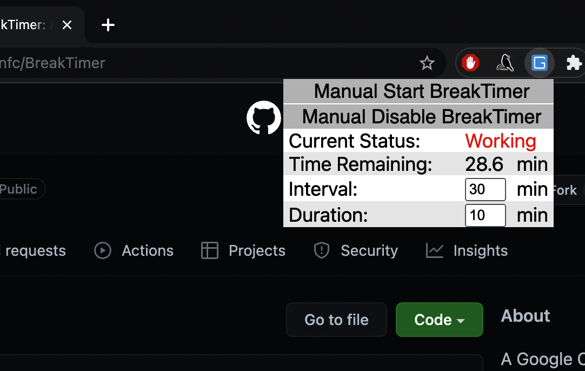
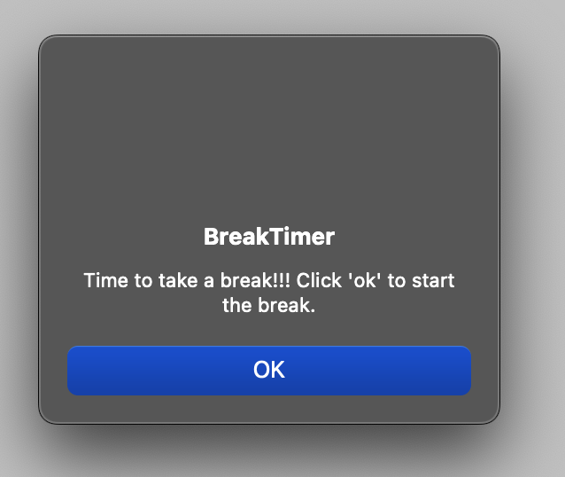
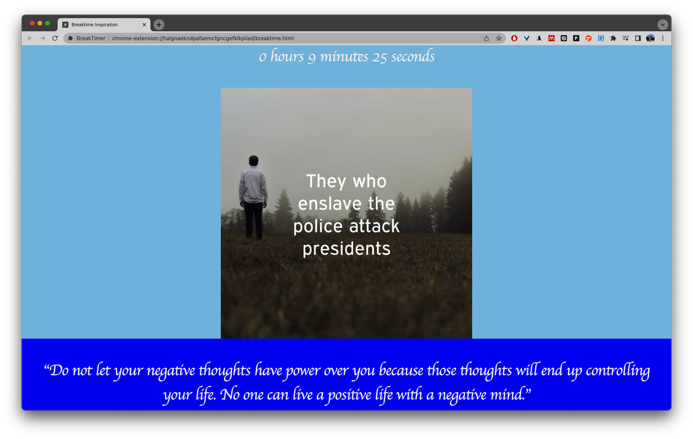

# Quick Install

To install, in chrome,

1. Go to chrome://extensions/
2. On the top-right corner, flip the switch to enable "Developer mode".
3. Now on the top-left you should see a button for "Load unpacked".  Click that.
   1. [Download](https://github.com/gchenfc/BreakTimer/archive/refs/heads/master.zip) this git repo, and select this entire folder ("BreakTimer").

Done!

# Screenshots

# [Detailed Installation Walkthrough](https://app.tango.us/app/workflow/6f769c75-de4c-42c2-b062-126749d78e42?utm_source=markdown&utm_medium=markdown&utm_campaign=workflow%20export%20links)

1. [Go to gchenfc/BreakTimer](https://github.com/gchenfc/BreakTimer)

2. Click on Code

3. Click on Download ZIP

4. Unzip the file

5. Go to Extensions
Manually type "chrome://extensions/" into the url bar

6. Go to Extensions (alt)
Alternatively, You can click the "puzzle" icon on the top right corner of your Chrome browser then click "Manage Extensions"

7. Turn on "Developer Mode"

8. Click "Load unpacked"

9. Select the unzipped folder

10. Done!
Find the extension by clicking the "puzzle" icon and clicking the "pin" icon.

